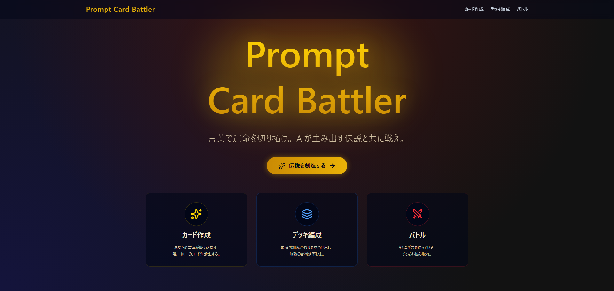
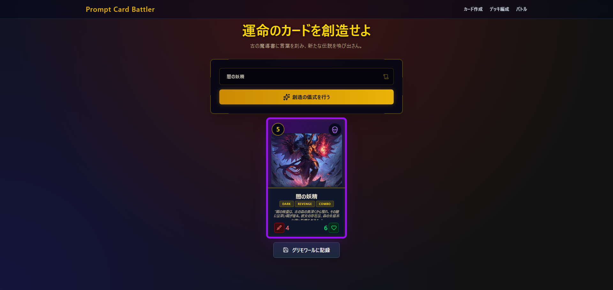
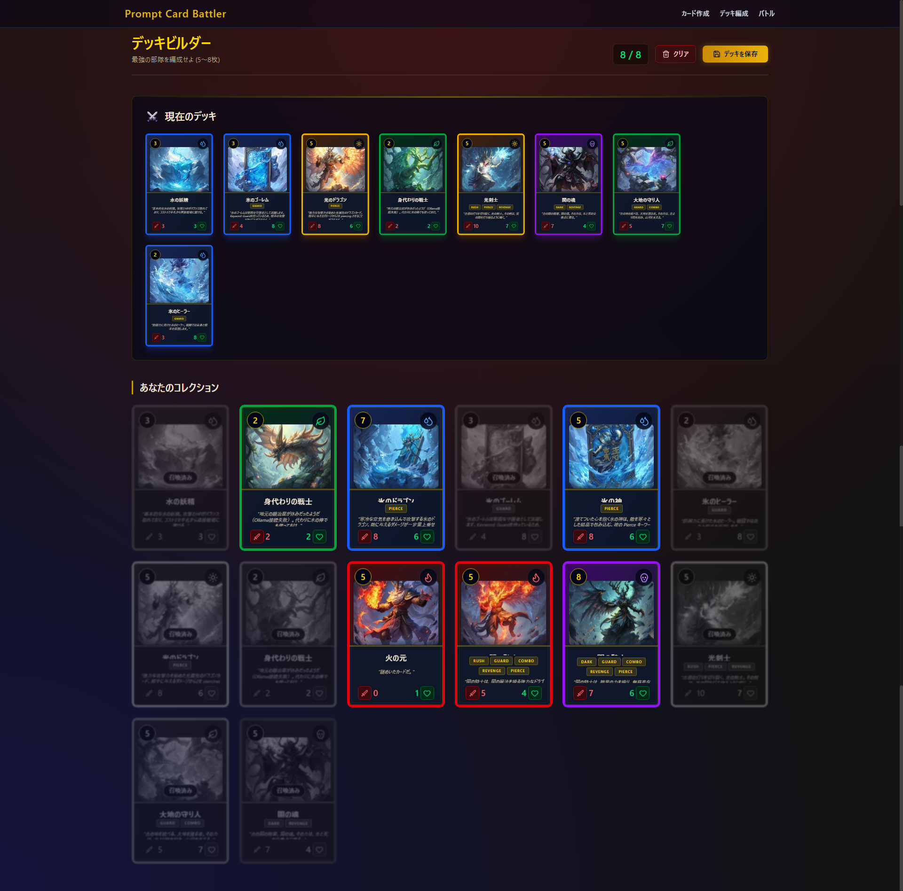
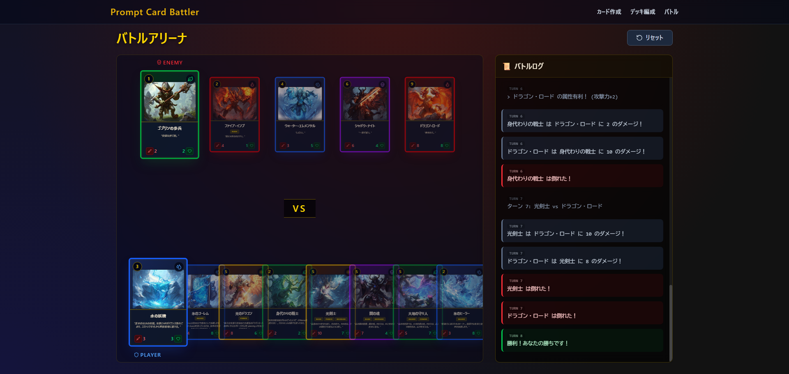
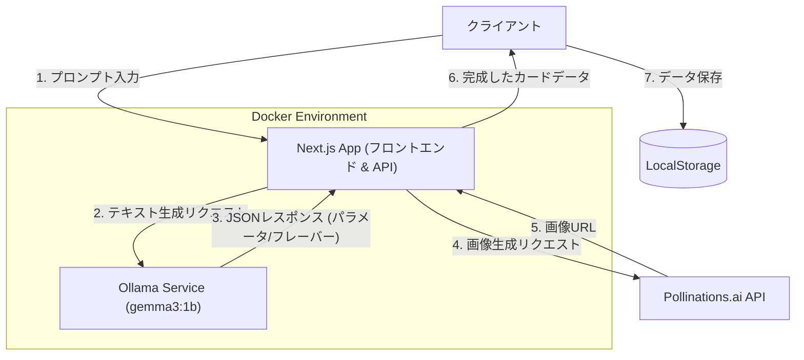

# Prompt Card Battler

テキストプロンプトからカードを生成し、対戦するAI搭載トレーディングカードゲームです。
ファンタジーRPGの世界観を模したリッチなUIと、ダイナミックなアニメーションで、没入感のある体験を提供します。

## ギャラリー (Gallery)

### ホーム画面 (Home)
ファンタジーの世界への入り口となる、没入感のあるヒーローセクション。


### カード作成 (Card Crafting)
「純粋な星の光で作られ、味方を癒やすドラゴン」のようなテキストから、独自のステータスとAI生成イラストを持つカードを創造します。


### デッキ編成 (Deck Building)
生成したカードコレクションから5〜8枚を選び、最強の部隊を編成します。


### バトルアリーナ (Battle Arena)
属性相性やスキルが飛び交うオートバトル。攻撃やダメージのアニメーションにより、戦況が視覚的に楽しめます。


## 特徴

- **AIカード生成**: ローカルLLM (**gemma3:1b**) によるパラメータ生成と、Pollinations.aiによるリアルタイム画像生成を組み合わせ、世界に一枚だけのカードを生み出します。
- **ファンタジーUI**: 羊皮紙、金装飾、魔法のエフェクトなどを取り入れた、本格的なファンタジーデザイン。
- **ダイナミックアニメーション**: Framer Motionを使用した、カードの攻撃、ダメージ、登場時のスムーズなアニメーション。
- **レスポンシブデザイン**: デスクトップからタブレットまで、様々な画面サイズで美しく表示されるよう調整されています。

## 技術スタック

- **Frontend**: Next.js 15 (App Router), React 19
- **Styling**: Tailwind CSS v4, Framer Motion (Animations)
- **AI (Text)**: **Ollama** running **gemma3:1b** (Balanced & Strategic)
- **AI (Image)**: Pollinations.ai (Free API)
- **State Management**: Zustand, LocalStorage (Persistence)
- **Environment**: Docker Compose

## アーキテクチャ (Architecture)




## パフォーマンスについて (Performance Note)

デフォルトではバランスの良い `gemma3:1b` モデルを使用するように設定されています。
もしGPUをお持ちで、より高品質なテキスト生成を行いたい場合は、`.env` ファイル（`.env.example` をコピーして作成）の `OLLAMA_MODEL` を `gemma-2-9b-it` などに変更し、`docker-compose.yml` のGPU設定のコメントアウトを外してください。

## 前提条件 (Prerequisites)

このプロジェクトを実行するには、以下の環境が必要です：

- **Docker & Docker Compose**
    - ローカルLLM (Ollama/gemma3:1b) をコンテナで実行するために使用します。
- **画像生成**
    - **Pollinations.ai** を使用 (APIキー不要・無料)

## 始め方 (Getting Started)

### Dockerでの実行 (推奨)

1.  リポジトリをクローンします。
2.  環境変数を設定します（オプション）:
    ```bash
    cp .env.example .env
    ```
3.  Docker Composeを使用してビルド・起動します:
    ```bash
    docker-compose up --build
    ```
    初回起動時、Ollamaコンテナは `gemma3:1b` モデルを自動的にダウンロードするため、完了まで数分かかる場合があります。

4.  ブラウザで [http://localhost:3000](http://localhost:3000) を開きます。

### ローカル開発 (Local Development)

もしDockerを使わずにローカルで開発する場合は、別途Ollamaをインストールし、`gemma3:1b` モデルをpullしておく必要があります。

1.  [Ollama](https://ollama.com/) をインストールし、起動します。
2.  モデルをダウンロードします: `ollama pull gemma3:1b`
3.  依存関係をインストールします: `npm install`
4.  開発サーバーを起動します: `npm run dev`

## ゲームルール

- **属性相性**:
    - 火 (Fire) > 自然 (Nature) > 水 (Water) > 火 (Fire)
    - 光 (Light) と 闇 (Dark) は互いに大ダメージ（相互弱点）
- **キーワード能力**:
    - **Rush (速攻)**: 召喚されたターンに即座に攻撃できる。
    - **Guard (守護)**: 敵はこのユニットを先に攻撃しなければならない。
    - **Combo (連撃)**: 1ターンに2回攻撃を行う。
    - **Revenge (復讐)**: 破壊されたときに敵にダメージを与える。
    - **Pierce (貫通)**: Guard (守護) を無視してリーダーや他のユニットを攻撃できる。
- **デッキサイズ**: 5枚〜8枚で編成する必要があります。
